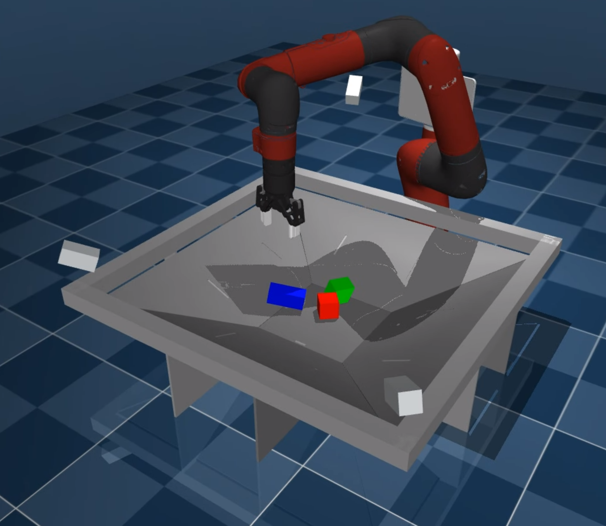

# RGB-stacking &#128721;&#129001;&#128311; for robotic manipulation
### [BLOG](https://deepmind.com/blog/article/stacking-our-way-to-more-general-robots) | [PAPER][pick_and_place_paper] | [VIDEO](https://youtu.be/BxOKPEtMuZw)

**Beyond Pick-and-Place: Tackling Robotic Stacking of Diverse Shapes,**\
Alex X. Lee*, Coline Devin*, Yuxiang Zhou*, Thomas Lampe*, Konstantinos Bousmalis*, Jost Tobias Springenberg*, Arunkumar Byravan, Abbas Abdolmaleki, Nimrod Gileadi, David Khosid, Claudio Fantacci, Jose Enrique Chen, Akhil Raju, Rae Jeong, Michael Neunert, Antoine Laurens, Stefano Saliceti, Federico Casarini, Martin Riedmiller, Raia Hadsell, Francesco Nori.\
In *Conference on Robot Learning (CoRL)*, 2021.



This repository contains an implementation of the simulation environment
described in the paper
["Beyond Pick-and-Place: Tackling robotic stacking of diverse shapes"][pick_and_place_paper].
Note that this is a re-implementation of the environment (to remove dependencies
on internal libraries). As a result, not all the features described in the paper
are available at this point. Noticeably, domain randomization is not included
in this release. We also aim to  provide reference performance metrics of
trained policies on this environment in the near future.

In this environment, the agent controls a robot arm with a parallel gripper
above a basket, which contains three objects — one red, one green, and one blue,
hence the name RGB. The agent's task is to stack the red object on top of the
blue object, within 20 seconds, while the green object serves as an obstacle and
distraction. The agent controls the robot using a 4D Cartesian controller. The
controlled DOFs are x, y, z and rotation around
the z axis. The simulation is a MuJoCo environment built using the
[Modular Manipulation (MoMa) framework](https://github.com/deepmind/robotics/tree/main/py/moma/README.md).


## Corresponding method
The RGB-stacking paper
["Beyond Pick-and-Place: Tackling robotic stacking of diverse shapes"][pick_and_place_paper]
also contains a description and thorough evaluation of our initial solution to
both the 'Skill Mastery' (training on the 5 designated test triplets and
evaluating on them) and the 'Skill Generalization' (training on triplets of
training objects and evaluating on the 5 test triplets). Our
approach was to first train a state-based policy in simulation via a standard RL
algorithm (we used [MPO](https://arxiv.org/abs/1806.06920)) followed by
interactive distillation of the state-based policy into a vision-based policy (using a
domain randomized version of the environment) that we then deployed to the robot
via zero-shot sim-to-real transfer. We finally improved the policy further via
offline RL based on data collected from the sim-to-real policy (we used [CRR](https://arxiv.org/abs/2006.15134)). For details on our method and the results
please consult the paper.

## Released specialist policies

This repository includes state-based policies that were trained on this
environment, which differs slightly from the internal one we used for the paper.
These are 5 specialist policies, each one trained on one test triplet. They
correspond to the Skill Mastery-State teacher in Table 1 of the manuscript and
they achieve 75% stacking success on average. In detail, the stacking success of
each agent over a run of 1000 episodes is (average of 2 seeds):

* Triplet 1: 77.7%
* Triplet 2: 47.4%
* Triplet 3: 83.5%
* Triplet 4: 79.9%
* Triplet 5: 89.5%
* Average:   75.6%

The policy weights in the directory `assets/saved_model` are made available
under the terms of the Creative Commons Attribution 4.0 (CC BY 4.0) license.
You may obtain a copy of the License at
https://creativecommons.org/licenses/by/4.0/legalcode.

## Installing and visualising the environment

Please ensure that you have a working
[MuJoCo200 installation](https://www.roboti.us/download.html) and a valid
[MuJoCo licence](https://www.roboti.us/license.html).

1. Clone this repository:

   ```bash
   git clone https://github.com/deepmind/rgb_stacking.git
   cd rgb_stacking
   ```

2. Prepare a Python 3 environment - venv is recommended.

   ```bash
   python3 -m venv rgb_stacking_venv
   source rgb_stacking_venv/bin/activate
   ```

3. Install dependencies:

   ```bash
   pip install -r requirements.txt
   ```

4. Run the environment viewer:

   ```bash
   python -m rgb_stacking.main
   ```

Step 2-4 can also be done by running the run.sh script:

   ```bash
   ./run.sh
   ```

By default, this loads the environment with a random test triplet and starts the
viewer for visualisation. Alternatively, the object set can be specified with
`--object_triplet` (see the relevant [section](#specifying-the-object-triplet)
for options).

## Specifying one of the released specialist policies

You can also load the environment along with a specialist policy using the flag
`--policy_object_triplet`. E.g. to execute the respective specialist in the
environment with triplet 4 use the following command:

   ```bash
   python -m rgb_stacking.main --object_triplet=rgb_test_triplet4 --policy_object_triplet=rgb_test_triplet4
   ```

Executing and visualising a policy in the viewer can be very slow.
Alternatively, using `launch_viewer=False` will render the policy and save it
 as `rendered_policy.mp4` in the current directory.

   ```bash
   MUJOCO_GL=egl python -m rgb_stacking.main --launch_viewer=False --object_triplet=rgb_test_triplet4 --policy_object_triplet=rgb_test_triplet4
   ```

## Specifying the object triplet

The default environment will load with a random test triplet (see Sect. 3.2.1 in
the paper). If you wish to use a different triplet you can use the following
commands:

   ```python
   from rgb_stacking import environment

   env = environment.rgb_stacking(object_triplet=NAME_OF_TRIPLET)
   ```

The possible `NAME_OF_TRIPLET` are:

* `rgb_test_triplet{i}` where `i` is one of 1, 2, 3, 4, 5: Loads test triplet `i`.
* `rgb_test_random`: Randomly loads one of the 5 test triplets.
* `rgb_train_random`: Triplet comprised of blocks from the training set.
* `rgb_heldout_random`: Triplet comprised of blocks from the held-out set.

For more information on the blocks and the possible options, please refer to
the [rgb_objects repository](https://github.com/deepmind/dm_robotics/tree/main/py/manipulation/props/rgb_objects/README.md).

## Specifying the observation space

By default, the observations exposed by the environment are only the ones we
used for training our state-based agents. To use another set of observations
please use the following code snippet:

   ```python
   from rgb_stacking import environment

   env = environment.rgb_stacking(
    observations=environment.ObservationSet.CHOSEN_SET)
   ```

The possible `CHOSEN_SET` are:

* `STATE_ONLY`: Only the state observations, used for training expert policies
    from state in simulation (stage 1).
* `VISION_ONLY`: Only image observations.
* `ALL`: All observations.
* `INTERACTIVE_IMITATION_LEARNING`: Pair of image observations and a subset of
    proprioception observations, used for interactive imitation learning
    (stage 2).
* `OFFLINE_POLICY_IMPROVEMENT`:  Pair of image observations and a subset of
    proprioception observations, used for the one-step offline policy
    improvement (stage 3).

## Real RGB-Stacking Environment: CAD models and assembly instructions

The [CAD model](https://deepmind.onshape.com/documents/d0b99322019b124525012b2a/w/6702310a5b51c79efed7c65b/e/4b6eb89dc085468d0fee5e97)
of the setup is available in onshape.

We also provide the following [documents](https://github.com/deepmind/rgb_stacking/tree/main/real_cell_documentation)
for the assembly of the real cell:

  * Assembly instructions for the basket.
  * Assembly instructions for the robot.
  * Assembly instructions for the cell.
  * The bill of materials of all the necessary parts.
  * A diagram with the wiring of cell.

The RGB-objects themselves can be 3D-printed using the STLs available in the [rgb_objects repository](https://github.com/deepmind/dm_robotics/tree/main/py/manipulation/props/rgb_objects/README.md).

## Citing

If you use `rgb_stacking` in your work, please cite the accompanying [paper][pick_and_place_paper]:

```bibtex
@inproceedings{lee2021rgbstacking,
    title={Beyond Pick-and-Place: Tackling Robotic Stacking of Diverse Shapes},
    author={Alex X. Lee and
            Coline Devin and
            Yuxiang Zhou and
            Thomas Lampe and
            Konstantinos Bousmalis and
            Jost Tobias Springenberg and
            Arunkumar Byravan and
            Abbas Abdolmaleki and
            Nimrod Gileadi and
            David Khosid and
            Claudio Fantacci and
            Jose Enrique Chen and
            Akhil Raju and
            Rae Jeong and
            Michael Neunert and
            Antoine Laurens and
            Stefano Saliceti and
            Federico Casarini and
            Martin Riedmiller and
            Raia Hadsell and
            Francesco Nori},
    booktitle={Conference on Robot Learning (CoRL)},
    year={2021},
    url={https://openreview.net/forum?id=U0Q8CrtBJxJ}
}
```

<!-- Hyperlinks  -->
[pick_and_place_paper]: http://arxiv.org/abs/2110.06192
